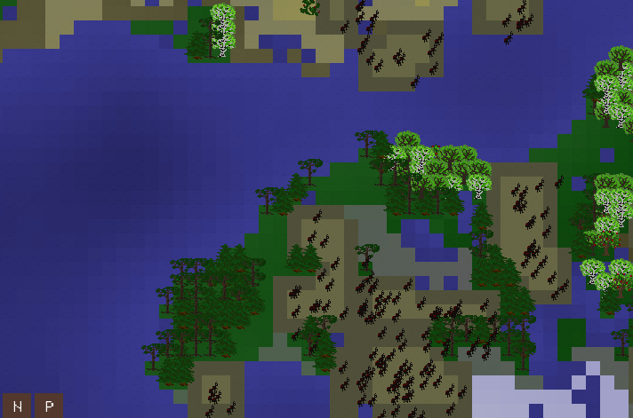

# MECHANTS



## Summary

Mechants is application with three functionalities:

    - world generation
    - socket server to the world
    - client

The program is implemented in Rust with SDL graphics library.

## Running

### Compile from source

Clone this repo, install dependencies from ```other_dependencies.txt```, and then ```cargo run --bin server``` and ```cargo run --bin client``` in separate shells. You should see the program running now.


### Other ways coming soon...


## Credits

Programming: Eino Korte
Art: Henna-Mari Vasama
